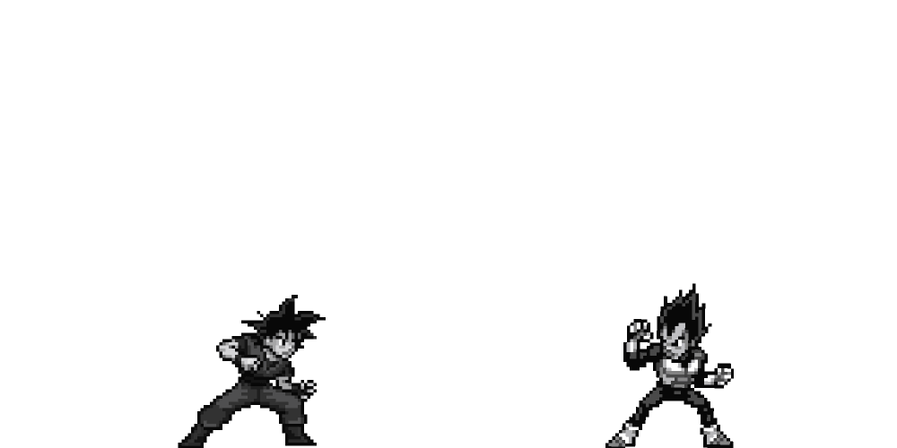

  

  

 

 GITHUB TROPHIES

  

RESEARCH INTERESTS
* ⚛️ **Antimatter & Particle Accelerators:** Manipulating the building blocks of the universe.
* 🔋 **Ion Sources & Thrusters:** Engineering the next generation of ion propulsion systems.
* ⚡ **Beam Extraction & Transport:** Precision control of charged particles.
* 🧬 **Digital Twins:** Constructing virtual twins of physical reality.
* 🎮 **Game Design:** Applying simulation logic to interactive worlds and gamification.

 

 DAILY CONTRIBUTIONS

  

 

 TECH STACK

  

 

 DAILY WISDOM

  

 

  

 

  

 

 METRICS 

  

 

    

 

<h3 align="center">
  
</h3>

 

  

