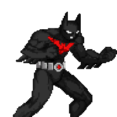

  

  

  

  

---

### 📂 SUBJECT: ABOUT ME
> [!IMPORTANT]
> **I am a Research Associate with the University of Liverpool.** Currently, I work with **beam dynamics simulations** for the **AEgIS antimatter experiment at CERN**. 

**Tactical Interests & Research:**
* ⚛️ **Antimatter & Particle Accelerators:** Tracking the building blocks of the universe.
* 🔋 **Ion Sources & Thrusters:** Engineering the next generation of propulsion.
* ⚡ **Beam Extraction & Transport:** Precision control of charged particles.
* 🧬 **Digital Twins:** Constructing virtual shadows of physical reality.
* 🎮 **Game Design:** Applying simulation logic to interactive worlds.

---

### ⚔️ THE KILL BILL TOOLKIT (Tech Stack)

  
  
  
  
  
  

---

### 📊 MISSION ANALYTICS (GitHub Stats)

  
   
  

---

### 🕹️ SYSTEM STATUS: THE UPSIDE DOWN

  

  <i>"It's not who I am underneath, but what I do that defines me."</i>

---

  

